# Detailed Comprehensive Implementation Plan

## Mongol Livestock Disease Surveillance Dataset (MLDSD) – 4‑Week Execution

### Overview

This plan transforms the dataset design into a **day‑by‑day, resource‑aware, risk‑mitigated implementation**. The goal: deliver a high‑quality, open‑source dataset with documentation within **28 calendar days** by a team of **3 people** (1 data scientist, 1 Mongolian veterinary expert/annotator lead, 1 data engineer).

---

## 1. Team Roles & Responsibilities

| Role | Person (assumed) | Key Responsibilities |
|------|------------------|----------------------|
| **Project Lead / Data Scientist** | You | Overall coordination, MoU with GAVS, OCR pipeline, baseline model, documentation |
| **Veterinary Annotator Lead** | Local partner (Mongolia) | Annotator training, quality control, adjudication, liaison with GAVS |
| **Data Engineer** | Team member | Scripting (scanning, OCR, cleaning), repository management, versioning |
| **2 Contract Annotators** | Hired (remote) | Manual transcription and NER labeling (250 reports/day each) |

---

## 2. Pre‑Implementation Checklist (Week 0)

- [x] Signed MoU with General Authority for Veterinary Services (GAVS) – *assumed secured*
- [x] Ethics approval from Mongolian National University of Medical Sciences – *letter in hand*
- [x] Pilot data access: 500 scanned reports from Dornod aimag (already digitised)
- [ ] Budget: $2,500 for double‑entry transcription (5000 reports × $0.50)
- [ ] Infrastructure: Google Cloud Vision API credits ($200), GitHub repository, Zenodo draft DOI
- [ ] Annotator recruitment: 2 fluent Mongolian speakers with veterinary terminology training

---

## 3. Implementation Phases (Week 1–4)

### Week 1 – Data Acquisition & Digitisation

| Day | Tasks | Owner | Deliverable | Risk Mitigation |
|-----|-------|-------|-------------|------------------|
| **Mon** | Finalise MoU, receive access to physical archive (Ulaanbaatar) | Lead | Signed data access agreement | Fallback: WOAH public tables if archive delayed |
| **Tue‑Wed** | Scan 5,000 paper forms (600 DPI, TIFF) using GAVS’s high‑speed scanner | Data Engineer | 5,000 TIFF files (50 GB) | Verify each page is legible; re‑scan illegible forms |
| **Thu** | Upload scans to secure cloud (encrypted S3 bucket) | Data Engineer | Cloud backup | 2‑factor authentication; checksums for integrity |
| **Fri** | Run OCR (Google Cloud Vision – Cyrillic handwriting model) | Data Engineer | OCR text per report (JSON) | Manual spot‑check 50 reports; if >5% character error, adjust preprocessing |

**End of Week 1 Milestone**: 5,000 raw OCR text files + scans backed up.

---

### Week 2 – Manual Transcription & Cleaning

| Day | Tasks | Owner | Deliverable | Quality Check |
|-----|-------|-------|-------------|---------------|
| **Mon** | Hire 2 annotators (Mongolian veterinary students) | Annotator Lead | Signed contracts + NDA | Test with 20 pilot reports; accept if >95% agreement with gold |
| **Tue** | Train annotators: guidelines, edge cases, tool (LabelStudio) | Annotator Lead | Training completion certificate | Inter‑annotator agreement on 50 practice reports ≥0.85 |
| **Wed‑Thu** | Double‑entry transcription: each report typed twice (blind) | 2 Annotators | 10,000 transcriptions (2 per report) | Automated diff tool highlights mismatches |
| **Fri** | Resolve discrepancies (adjudicator = Annotator Lead) | Annotator Lead | Final 5,000 cleaned `raw_text` fields | Discrepancy rate <5% |

**End of Week 2 Milestone**: Clean, manually verified `raw_text` for all 5,000 reports.

---

### Week 3 – NER Annotation & Quality Control

| Day | Tasks | Owner | Deliverable | Metrics |
|-----|-------|-------|-------------|---------|
| **Mon** | Pre‑annotation: rule‑based NER (disease dictionary, regex for counts) | Data Scientist | Pre‑labeled spans (JSONL) | Recall on pilot: 0.60 – reduces annotator time |
| **Tue‑Wed** | Manual annotation (using LabelStudio) by 2 annotators | Annotators | Labeled spans for 5,000 reports (each annotator does 2,500 different reports) | Speed: 125 reports/hour/person |
| **Thu** | IAA calculation on 20% sample (1,000 reports double‑annotated) | Data Scientist | Fleiss’ kappa report | Target κ ≥ 0.80. If below, retrain on error types and re‑annotate. |
| **Fri** | Adjudication of disagreements (veterinary expert) | Annotator Lead | Final gold spans | Disagreement resolution log |

**End of Week 3 Milestone**: Complete NER annotations (gold standard) for 5,000 reports.

---

### Week 4 – Final Processing, Documentation & Release

| Day | Tasks | Owner | Deliverable |
|-----|-------|-------|-------------|
| **Mon** | Derive `outbreak_label` (affected_count≥10 or died_count>0), split train/val/test (80/10/10) | Data Engineer | Final CSVs + JSONL |
| **Tue** | Anonymisation: hash veterinarian names, aggregate soum to aimag level (public release) | Data Engineer | Anonymised dataset (aimag only) |
| **Wed** | Write documentation: README, data dictionary, limitations, ethical review | Lead | `docs/` folder complete |
| **Thu** | Build baseline model (XLM‑RoBERTa fine‑tune on 4,000 train reports) | Data Scientist | `baseline_ner.ipynb` with evaluation metrics |
| **Fri** | Package repository, upload to HuggingFace + Zenodo, assign DOI | Data Engineer | Public release v1.0.0 |

**End of Week 4 Milestone**: Publicly available dataset, documentation, baseline model, and reproduction scripts.

---

## 4. Resource Requirements (Detailed)

| Item | Specification | Cost / Source |
|------|---------------|----------------|
| **Personnel** | 1 Lead (20% time), 1 Data Engineer (100% time), 1 Annotator Lead (50% time), 2 Contract Annotators (full‑time week 2‑3) | $4,000 total (assumed grant or prize) |
| **Scanning** | Using GAVS’s own scanner (no cost) | $0 |
| **OCR** | Google Cloud Vision – 5,000 pages × $0.0015 = $7.50 | $7.50 |
| **Cloud storage** | AWS S3 + Glacier (50 GB) | $5/month |
| **Annotation tool** | LabelStudio Community Edition (self‑hosted on free tier) | $0 |
| **Compute** | Google Colab Pro (for baseline model) | $10 |
| **Total** | | **$4,022.50** |

*Note: If no external funding, reduce to 2,000 reports (cost $1,600) and release as v0.9.*

---

## 5. Risk Register & Contingencies

| Risk | Probability | Impact | Mitigation | Contingency Plan |
|------|-------------|--------|------------|------------------|
| **GAVS withdraws access** | Low (MoU signed) | High | Use pilot 500 reports + WOAH public tables | Release v0.5 as “Mongolian Veterinary Text Corpus” without location |
| **Annotator attrition** | Medium | Medium | Over‑hire 3 annotators; cross‑train | Extend week 3 by 2 days; reduce target to 4,000 reports |
| **Low IAA (<0.70)** | Medium | High | Daily calibration sessions; simplify labels (merge COUNT_AFFECTED/DIED into COUNT) | Use majority vote without adjudication; document low agreement |
| **OCR + manual transcription time exceeds** | Medium | Medium | Use OCR text directly (no double‑entry) for 50% of reports | Release with “ocr_only” flag; lower quality but still useful |
| **Legal challenge (privacy)** | Low | High | Already anonymised; vet names hashed; no herder data | Remove all location fields; release as disease‑only corpus |
| **Repository not ready by week 4** | Low | Medium | Freeze features on day 25; release v1.0 even if baseline model incomplete | Provide only data + schema; model notebook added within 1 week post‑release |

---

## 6. Quality Assurance Gates

Before moving to the next phase, each gate must be passed:

| Gate | Checkpoint | Pass Criteria |
|------|------------|---------------|
| **G1** | End of Week 1 | OCR character accuracy ≥90% on 50 random samples (measured by edit distance to manual transcription). |
| **G2** | End of Week 2 | Discrepancy rate between double‑entry transcriptions <5%; no PII remains. |
| **G3** | End of Week 3 | IAA κ ≥ 0.75 (strict) or ≥0.80 (relaxed) – relaxed accepts partial span overlaps. |
| **G4** | End of Week 4 | Repository passes `pytest` on data schema (e.g., no nulls in required columns, correct data types). |

---

## 7. Detailed Task Breakdown (Gantt)

| Week | Mon | Tue | Wed | Thu | Fri | Sat | Sun |
|------|-----|-----|-----|-----|-----|-----|-----|
| **W0** | MoU final | Ethics | Budget | Recruit | Pilot | – | – |
| **W1** | Access | Scan1 | Scan2 | Upload | OCR | (buffer) | – |
| **W2** | Hire | Train | Transcr1 | Transcr2 | Adjud | (buffer) | – |
| **W3** | Pre‑label | Annot1 | Annot2 | IAA | Adjud | (buffer) | – |
| **W4** | Derive | Anonym | Docs | Baseline | Release | (post‑release) | – |

**Buffer days** (Sat) allow for slippage. Total slack: 4 days.

---

## 8. Data Processing Pipeline (Technical)

```mermaid
graph LR
    A[Paper forms] --> B[Scanning 600 DPI]
    B --> C[Google Cloud Vision OCR]
    C --> D[Manual double‑entry transcription]
    D --> E[Text cleaning & normalisation]
    E --> F[Pre‑annotation rule‑based NER]
    F --> G[Manual NER annotation LabelStudio]
    G --> H[IAA & adjudication]
    H --> I[Final spans & structured CSV]
    I --> J[Anonymisation & aggregation]
    J --> K[Train/val/test split]
    K --> L[Repository + HuggingFace]
```



**Scripts** (in `data/scripts/`):
- `01_scan_ocr.py` – calls Vision API, outputs JSON per report.
- `02_clean_text.py` – removes control chars, normalises whitespace.
- `03_anonymize.py` – hashes vet names, redacts soum (optional).
- `04_pre_annotation.py` – uses dictionaries and regex to create initial spans.
- `05_export_to_labelstudio.py` – converts to LabelStudio JSON format.
- `06_import_from_labelstudio.py` – imports annotated spans back.
- `07_compute_iaa.py` – calculates Fleiss’ kappa.
- `08_split_data.py` – stratified split by disease and year.

---

## 9. Baseline Model Implementation Details

**Environment**:
```bash
conda create -n mldsd python=3.10
conda activate mldsd
pip install transformers datasets torch seqeval scikit-learn
```

**Training script** (`examples/baseline_ner.py`):
- Loads `train.csv` and `ner_spans.jsonl`.
- Converts spans to token‑level BIO tags using XLM‑RoBERTa tokeniser.
- Fine‑tune with `Trainer` API (HuggingFace).
- Evaluation: seqeval’s `classification_report`.

**Expected runtime**: 45 minutes on Google Colab T4 GPU.

**Output**: Model checkpoints, evaluation metrics, confusion matrix.

---

## 10. Release & Post‑Release Plan

### Immediate Release (Day 28)
- **Zenodo DOI**: v1.0.0 archived (5,000 reports).
- **HuggingFace**: `mldsd/mldsd` dataset with dataset viewer.
- **GitHub**: Repository public under CC BY‑NC 4.0.

### Week 5 – Community Engagement
- Announce on Twitter, Masakhane Slack, ACL low‑resource SIG.
- Request feedback and contributions (additional reports, corrections).
- Set up issue templates for bug reports.

### Month 2 – v1.1.0 (if funded)
- Add 2,000 reports from western aimags.
- Include Kazakh language subset (200 reports).
- Release fine‑tuned NER model to HuggingFace Hub.

---

## 11. Success Metrics for the Challenge Submission

| Criterion | Target | Measurement |
|-----------|--------|-------------|
| **Underserved domain** | 5/5 | Zero existing ML datasets for veterinary epidemiology in Mongolia |
| **Scarce open data** | 5/5 | No open dataset of raw animal disease reports globally |
| **Under‑resourced language** | 4/5 | First veterinary corpus for Mongolian; includes Kazakh |
| **Reproducibility** | Pass | Another team can run `scripts/` from scratch on the released scans |
| **Documentation** | Complete | All sections from Phase 10 present and filled |
| **Practical utility** | Demonstrated | Baseline model F1 >0.70; SMS use case notebook |

---

## 12. Daily Execution Checklist (For the Lead)

**Each morning**:
- [ ] Review yesterday’s outputs against quality gates.
- [ ] Assign today’s tasks to team (Slack stand‑up).
- [ ] Check annotator progress (LabelStudio dashboard).
- [ ] Update risk register with any new issues.

**Each evening**:
- [ ] Commit code and data updates to private branch.
- [ ] Run automated validation scripts.
- [ ] Send progress report to GAVS (if required).
- [ ] Backup all raw and processed data to encrypted cloud.

---

## 13. Final Words

This implementation plan is **actionable, resource‑aware, and risk‑mitigated**. It respects the 4‑week timeline while delivering a dataset that meets the Uncharted Data Challenge’s highest criteria. Every step has been designed for a small team with limited budget, and the fallback strategies ensure that even partial success yields a useful open‑source resource.

**The only remaining action is to execute.**
